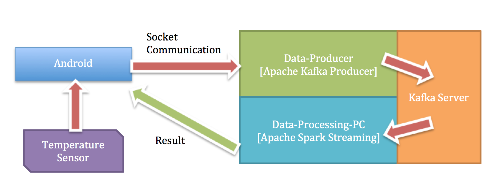
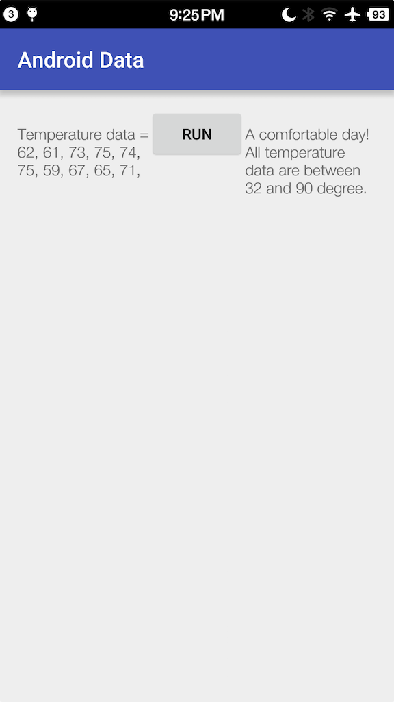

# Data-Processing - Server program
An Android app that analyzes data stream from a temperature sensor. This is the server program running on PC or Mac.  
The client program is in [Data-Processing-Android repo](https://github.com/maxwyb/Data-Processing-Android).

## General Idea
Temperature data is processed on server, with the analysis result sent back to client. Client and server communication is through Socket in Java via TCP/IP. Two programs are simultaneously running on the server: `Data-Producer` receivers data coming from the Android device and sends them to Kafka server(s). Meanwhile, `Data-Processing-PC` analyzes data in real time by Apache Spark Streaming, and sends results back to Android device.  

Apache Kafka supports distributed data management by multiple servers and is fault-tolerant, and Apache Spark Stream supports parallel data processing. Therefore, this architecture is capable of processing large data streams.




## Installation
The guide uses Mac OS X Yosemite and real device Smartisan YQ603 running Android 5.1.1 as example. The Android app should also be able to run on Emulators on Android Studio.
The server and client should be better in the same local network, to avoid external/internal IP issues and ensure reachability.

### Server side - build the projects
1. Download this repository. If you do not have Eclipse installed on computer, download the latest version from [here](https://eclipse.org/downloads/).
2. Open Eclipse. When prompted to select Workspace, choose the root path of this repo. There should be two projects shown in Eclipse's `Project Manager`: `Data-Processing-PC` and `Data-Producer`.
3. Update the IP addresses of the computer and the Android device in the source file `Data-Processing-PC/src/com.ucla.max.DataProcessing/DataProcessing.java` and `Data-Producer/src/com.ucla.max.DataProducer/DataProducer.java`. There should be two global constants named `PC_IP` and `ANDROID_IP`. Make sure the `PORT` used in data transfer is not occupied by other programs.
4. Select project `Data-Processing-PC` in `Package Manager`; select `Run - Run As.. - Maven Build`. This should automatically build the program by
```bash
mvn clean
mvn generate-sources
mvn install
```
If not, do these manually in `Run - Run As...` manual. Do the same to `Data-Producer` project.

### Server side - configure Kafka server
1. Download Apache Kafka binary program with Scala 2.11 from [here](https://www.apache.org/dyn/closer.cgi?path=/kafka/0.9.0.1/kafka_2.11-0.9.0.1.tgz). Open a Terminal and `cd` into the download directory.
2. Run the following commands to set up a zookeeper and Kafka server, and create a topic called `temperature` to store data from temperature sensor. For simplicity, here we create a standalone Kafka server with no fault-tolerance.
```bash
tar -xzf kafka_2.11-0.9.0.1.tgz
cd kafka_2.11-0.9.0.1

bin/zookeeper-server-start.sh config/zookeeper.properties
bin/kafka-server-start.sh config/server.properties

bin/kafka-topics.sh --create --zookeeper localhost:2181 --replication-factor 1 --partitions 1 --topic temperature
```
3. We can open two other terminal windows for Kafka producer and consumer, to monitor the data on Kafka server.
```bash
bin/kafka-console-producer.sh --broker-list localhost:9092 --topic temperature
bin/kafka-console-consumer.sh --zookeeper localhost:2181 --topic temperature --from-beginning
```
Detailed instructions on Apache Kafka can be found on this [Quick Start guide](http://kafka.apache.org/documentation.html#quickstart).

### Server side - Run the server programs
1. Open a terminal window and `cd` into Eclipse Workspace. First run the `Data-Processing-PC` program:
```bash
mvn exec:java -D exec.mainClass=com.ucla.max.DataProcessing.DataTransfer > ~/Desktop/DataProcessing-output.txt
```
The standard output is piped to a text file which makes it easier to examine incoming data on Kafka server. This may generate some Exception warning messages that can be ignored.
2. Open another terminal window in the Workspace, and run the `Data-Producer` program:
```bash
mvn exec:java -D exec.mainClass=com.ucla.max.DataProducer.DataProducer
```

### Client side - Install & run the Android app
1. If Android Studio is not already installed, download it from [here](http://developer.android.com/tools/studio/index.html).
2. Download the Android app project from [Data-Processing-Android repo](https://github.com/maxwyb/Data-Processing-Android). Import this project into Android Studio.
3. Open `AndroidData - app - src - main - java - com - ucla - max - androiddata - MainActivity.java` file, and change the global variable `PC_IP` and `ANDROID_IP` to the current IP addresses of server and client. Make sure `PORT` is not used by other applications.
4. Connect your Android device to the computer; make sure its USB debugging mode in `Developer Settings` is enabled. In Android Studio, click `Run - Run "app"` and select the device to run the app.
5. After clicking the button in the app, some simulated temperature data should appear on the left, and analysis results of these data will be shown on the right as log.


## How to check IP address
Simply search "ip" on Google.


## Future
We plan to add more rules on Apache Spark for processing temperature data, to provide more meaningful results.  
Currently the server is deployed on local machine. We could move it to remote servers such as Amazon EC2, and add multiple Kafka servers to increase processing power and support fault-tolerance. 
  	